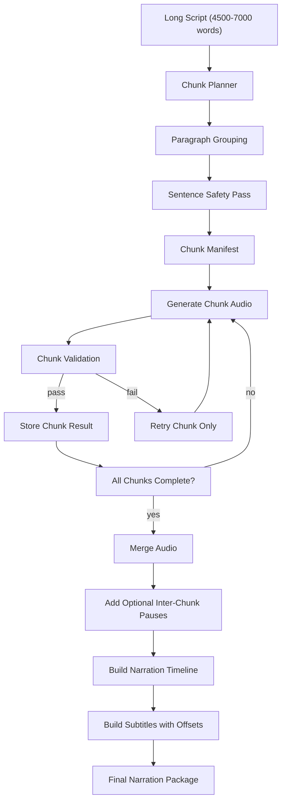
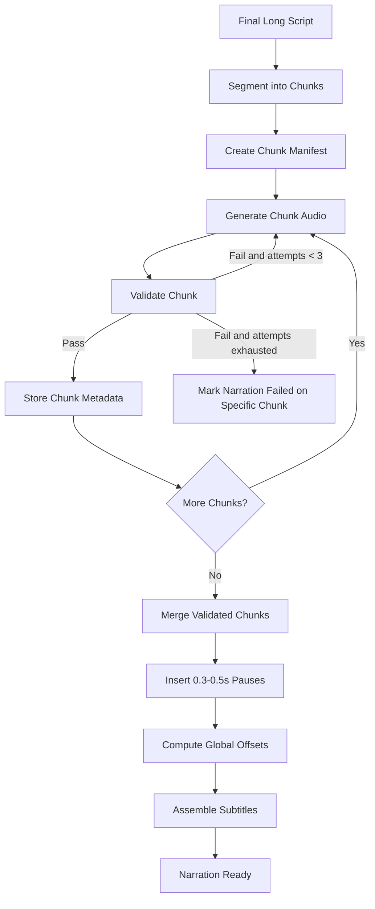

# Longform Narration Engine V1

Date: 2026-06-12
Status: Design only
Scope: Production-safe narration engine for Buddhist long-form videos

## Goal

Design a narration engine that can safely generate audio for:

- `30-45 minute` Buddhist long-form videos
- `4500-7000 word` scripts
- local VieNeu-TTS backend
- chunk-only retry and validation

This design does **not** replace the current TTS stack. It wraps the existing local TTS path in a safer long-form orchestration layer.

## Design Principles

- Keep the accepted local TTS decision: VieNeu-TTS remains the synth engine.
- Never send an entire long-form script as one TTS request.
- Treat chunking as a production safety boundary, not just a convenience.
- Validate every chunk before merge.
- Retry only failed chunks.
- Preserve future flexibility for multiple speakers and cloned voices.
- Optimize for reliable publishing, not architecture purity.

## V1 Summary

V1 should generate long-form narration in three layers:

1. `Script segmentation layer`
2. `Chunk generation + validation layer`
3. `Narration merge + subtitle assembly layer`

Recommended V1 operating profile:

- preferred chunk size: `500-750 words`
- default target: `650 words`
- hard limit: `1000 words`
- paragraph-aware
- sentence-safe
- single narrator voice for V1
- chunk-level subtitle timing

## Architecture

### High-level flow



### Core components

#### 1. Chunk Planner

Responsibility:

- split a long script into safe TTS chunks
- preserve paragraph meaning
- avoid sentence break damage
- keep chunk sizes within TTS-safe bounds

#### 2. Chunk Synth Runner

Responsibility:

- submit one chunk to TTS
- record generation metrics
- save raw chunk audio path
- support retry at chunk granularity only

#### 3. Chunk Validator

Responsibility:

- verify file existence
- verify duration
- verify silence ratio
- verify file size sanity
- produce pass/fail result and reasons

#### 4. Narration Merger

Responsibility:

- concatenate validated chunks in order
- insert optional small pauses between chunks
- produce chapter/time offset map

#### 5. Subtitle Assembler

Responsibility:

- use per-chunk timestamps
- offset each chunk into global narration time
- emit sentence-level subtitle timing

## Chunking Architecture

### Input assumptions

Input script:

- already finalized long-form script
- expected to contain paragraphs
- may contain uneven paragraph sizes

### Chunking goals

Each chunk should:

- prefer `500-750 words`
- target `650 words`
- never exceed `1000 words`
- end on a sentence boundary whenever possible
- preserve paragraph blocks when possible

### Chunking algorithm

#### Step 1. Normalize structure

Pre-chunk planning should treat the script as:

- paragraphs
- sentences inside paragraphs
- word counts per paragraph and per sentence

#### Step 2. Paragraph-first grouping

Build chunks by accumulating full paragraphs until:

- chunk is within preferred range, or
- adding the next paragraph would push the chunk over `750` words

#### Step 3. Sentence-safe overflow handling

If a paragraph would push a chunk above preferred size:

- start a new chunk if current chunk is already `>= 500 words`
- otherwise split the oversized paragraph by sentence

#### Step 4. Hard-limit enforcement

If any single paragraph or paragraph-fragment still exceeds `1000 words`:

- split by sentence groups
- if one sentence alone is oversized, keep it isolated and flag it as a script-quality issue

### Chunk boundary rules

Preferred boundary order:

1. paragraph boundary
2. sentence boundary
3. clause boundary only as emergency fallback

Avoid:

- breaking quotations mid-thought
- splitting bullet items from their explanation
- splitting scripture-like parallel phrases across chunks unless unavoidable

### Target chunk counts

For `4500-7000` words:

- at `650 words/chunk` => about `7-11 chunks`
- at `750 words/chunk` => about `6-10 chunks`

This is a safe and manageable orchestration range for V1.

## Chunk Metadata

Each chunk should store the following minimum fields.

## Metadata Schema

```ts
type NarrationChunk = {
  narrationId: string;
  chunkIndex: number;
  chunkId: string;
  sourceText: string;
  wordCount: number;
  estimatedDurationSec: number;
  audioPath: string | null;
  generationTimeMs: number | null;
  validationResult: "pending" | "passed" | "failed";
};
```

### Required V1 fields

- `chunkIndex`
  - zero-based or one-based, but fixed consistently
- `wordCount`
  - source words in the chunk
- `estimatedDuration`
  - pre-generation estimate for scheduling and merge planning
- `audioPath`
  - chunk WAV path after successful generation
- `generationTime`
  - elapsed synth time for that chunk only
- `validationResult`
  - pass/fail state

### Recommended extended metadata

V1 should also include:

- `chunkId`
- `narrationId`
- `paragraphStartIndex`
- `paragraphEndIndex`
- `sentenceCount`
- `voiceId`
- `ttsAttemptCount`
- `validationErrors`
- `actualDurationSec`
- `fileSizeBytes`
- `silenceRatio`
- `createdAt`
- `updatedAt`

### Example operational schema

```ts
type NarrationChunkRecord = {
  narrationId: string;
  chunkId: string;
  chunkIndex: number;
  wordCount: number;
  sentenceCount: number;
  paragraphStartIndex: number;
  paragraphEndIndex: number;
  sourceText: string;
  estimatedDurationSec: number;
  actualDurationSec: number | null;
  audioPath: string | null;
  fileSizeBytes: number | null;
  generationTimeMs: number | null;
  ttsAttemptCount: number;
  validationResult: "pending" | "passed" | "failed";
  validationErrors: string[];
  silenceRatio: number | null;
  voiceId: string;
};
```

## Duration Estimation

V1 should estimate chunk duration before generation for planning and chapter layout.

Recommended estimation model:

- default Buddhist narration speed: `125-140 words/minute`
- use `130 wpm` as planning default

Formula:

- `estimatedDurationSec = wordCount / 130 * 60`

Examples:

- `500 words` => about `231s` (`3.8 min`)
- `650 words` => about `300s` (`5.0 min`)
- `750 words` => about `346s` (`5.8 min`)

This keeps chunk durations in a practical `4-6 minute` band.

## Validation Rules

V1 validation should be strict enough to stop broken audio, but simple enough to ship.

### Per-chunk required checks

#### 1. File exists

Pass when:

- `audioPath` is present
- file exists on disk

Fail when:

- missing path
- missing file

#### 2. Duration minimum threshold

Pass when:

- actual duration exceeds a minimum floor relative to chunk size

Recommended V1 rule:

- absolute floor: `> 20 seconds`
- relative floor: `>= 0.35 * estimatedDurationSec`

Reason:

- catches empty audio, heavily truncated outputs, and malformed WAVs

#### 3. Silence ratio check

Pass when:

- silence ratio stays under a defined maximum

Recommended V1 definition:

- detect silence below a configured threshold with FFmpeg or Whisper-derived gaps
- compute `silenceDuration / totalDuration`

Recommended V1 threshold:

- `silenceRatio <= 0.12`

Additional hard fail:

- any single interior silence gap `> 2.0s`, unless explicitly inserted as a chapter pause

#### 4. File size sanity check

Pass when:

- file size is plausible for duration and format

Recommended V1 rule:

- file size must be `> 50 KB`
- file size must not be far below expected PCM/WAV envelope for its duration

Simple V1 check:

- compare `fileSizeBytes / actualDurationSec`
- reject values below a minimum empirical threshold for the chosen WAV format

### Recommended extended checks for V1.1

Not required by the prompt, but strongly recommended next:

- transcript coverage vs source text
- repeated phrase detection
- max word-duration elongation check
- chunk-end tail-match check

## Validation Result Model

```ts
type ChunkValidationResult = {
  status: "passed" | "failed";
  checks: {
    fileExists: boolean;
    durationMinOk: boolean;
    silenceRatioOk: boolean;
    fileSizeOk: boolean;
  };
  metrics: {
    actualDurationSec: number | null;
    silenceRatio: number | null;
    fileSizeBytes: number | null;
  };
  errors: string[];
};
```

## Merge Strategy

### Merge goals

Merge should:

- preserve chunk order
- hide chunk seams
- keep pacing meditative and stable
- support subtitle offsetting
- support future chapter markers

### Audio merge behavior

Chunk merge order:

1. validate all chunks
2. normalize format consistency if needed
3. concatenate in `chunkIndex` order
4. insert optional pause between chunks

### Inter-chunk pause

Recommended V1 option:

- optional `0.3-0.5s` pause between chunks

Recommended default:

- `0.4s`

Rules:

- apply only between chunks
- do not add after the final chunk
- do not stack with any manually scripted chapter pause unless explicitly intended

### Chapter markers

V1 should prepare chapter timing metadata even if the publishing layer does not yet render YouTube chapters automatically.

Each chunk should expose:

- `chapterStartSec`
- `chapterEndSec`
- `chapterLabel`

Chapter labels can be:

- chunk-derived in V1
- later upgraded to semantic section titles

### Subtitle timing offsets

Each chunk subtitle/timestamp asset should remain local to the chunk first.

Global subtitle timing is built by:

- summing all prior chunk durations
- summing inserted inter-chunk pauses
- offsetting every timestamp in chunk `N` by that total

## Subtitle Strategy

### Preferred V1 strategy

Use:

- chunk timestamps
- sentence-level timing
- simple long-form subtitle style

### Why chunk timestamps

Chunk timestamps are safer because they:

- reduce Whisper/TTS alignment load per request
- localize timestamp failures
- allow retry of only one chunk
- make subtitle offsets deterministic at merge time

### Sentence-level timing

V1 should target sentence-level subtitle groups, not word-by-word karaoke and not giant paragraph blocks.

Recommended style:

- `1-2` short sentences per subtitle card
- `<= 16` words preferred per line group
- centered lower-third safe placement
- stable fade/no flashy animation

### Simple long-form subtitle style

V1 subtitle visual direction:

- high contrast
- calm, readable font
- moderate bottom margin
- no bouncing, scaling, or short-form kinetic behavior

Behavior:

- long enough on screen to read comfortably
- sentence-based chunking
- no rapid cuts synced to beats

### Subtitle data flow

1. generate chunk audio
2. create chunk timestamps
3. group timestamps into sentence-level captions
4. offset chunk captions into global timeline
5. emit final subtitle asset

## Retry Strategy

### Core rule

If a chunk fails:

- regenerate that chunk only
- never regenerate the whole narration

### Retry triggers

Retry a chunk when:

- synth request fails
- file missing
- validation fails
- timestamp generation fails for that chunk

### Retry limits

Recommended V1 policy:

- `max 3 attempts per chunk`

Attempt model:

1. retry same chunk, same voice
2. retry same chunk after brief backoff
3. retry same chunk with stronger cleanup/logging path

If still failing:

- mark narration run as blocked on specific chunk
- preserve all successful prior chunks

### What must never happen

Do not:

- erase passed chunks because one later chunk failed
- restart the entire narration from chunk `0`
- merge partially failed chunks into final narration

## Future Voice Strategy

V1 should ship with a single narrator voice, but the data model should not assume single-voice forever.

### Voice modes to support later

#### 1. Single narrator voice

Use case:

- standard Buddhist long-form narration

Benefits:

- simplest QA
- simplest tone consistency
- best fit for meditative format

#### 2. Multiple speakers

Use case:

- dialogue sections
- scripture/teacher/student framing
- intro voice plus main narrator

Design implication:

- chunk metadata must include `voiceId`
- merge layer must tolerate speaker changes

#### 3. Cloned voices

Use case:

- branded narrator identity
- channel-specific voice ownership

Design implication:

- voice abstraction should not be hardcoded to preset names only

#### 4. Emotional variation

Use case:

- softer guided meditation
- more reflective teaching
- more solemn scripture reading

Design implication:

- chunk or section metadata may later include `deliveryStyle` or `emotionProfile`

### V1 recommendation

For Buddhist long-form V1:

- use `one narrator voice`
- keep metadata ready for future `voiceId`
- do not introduce multiple speakers until chunk reliability is proven

## Data Model Overview

V1 should conceptually create two record types:

### Narration Run

```ts
type NarrationRun = {
  narrationId: string;
  contentId: string;
  totalWords: number;
  targetDurationMin: number;
  voiceId: string;
  chunkCount: number;
  status: "planning" | "generating" | "validating" | "merging" | "done" | "failed";
  mergedAudioPath: string | null;
  totalGenerationTimeMs: number | null;
};
```

### Narration Chunk

Use the `NarrationChunkRecord` schema defined earlier.

## Operational Flow

### End-to-end V1 flow

1. Read finalized long-form script.
2. Segment into paragraph-aware, sentence-safe chunks.
3. Build chunk manifest with estimated duration.
4. Generate chunk `0`.
5. Validate chunk `0`.
6. Retry chunk `0` if needed.
7. Repeat for all chunks.
8. Merge only validated chunks.
9. Insert optional `0.3-0.5s` inter-chunk pauses.
10. Build chapter offsets.
11. Build global subtitles from chunk timestamps.
12. Emit final narration package.

## Flow Diagram



## Implementation Phases

### Phase 1: Planning and manifest

Deliver:

- chunk planner
- chunk manifest model
- duration estimator

Success condition:

- any `4500-7000` word script can be deterministically split into safe chunks

### Phase 2: Chunk generation and validation

Deliver:

- chunk synth orchestration
- per-chunk metadata persistence
- required V1 validation checks
- retry-by-chunk logic

Success condition:

- failed chunks can be retried independently without losing passed chunks

### Phase 3: Merge and subtitles

Deliver:

- audio merge pipeline
- optional `0.4s` inter-chunk pause
- chapter offset map
- chunk-to-global subtitle offsetting

Success condition:

- merged narration and subtitles align cleanly across chunk boundaries

### Phase 4: Production hardening

Deliver:

- better validation thresholds from real samples
- reporting and observability
- queue/run summaries

Success condition:

- team can inspect narration quality from chunk-level metrics before publish

### Phase 5: Voice expansion

Deliver:

- per-section voice routing
- cloned voice support
- emotional delivery profiles

Success condition:

- future voice upgrades do not require redesign of chunk storage or merge logic

## Recommended V1 Defaults

- target chunk size: `650 words`
- preferred range: `500-750 words`
- hard limit: `1000 words`
- estimated speech rate: `130 wpm`
- inter-chunk pause default: `0.4s`
- max retry attempts per chunk: `3`
- validation required before merge: `yes`
- narrator mode: `single voice`

## Final Recommendation

Longform Narration Engine V1 should be a chunk-first orchestration layer on top of the current local TTS pipeline.

The key production decision is simple:

- treat `500-750 word` chunks as the stable unit of generation, validation, retry, merge, and subtitle timing

That design directly addresses the long-form TTS audit, preserves the existing TTS investment, and gives the project a safe path to `30-45 minute` Buddhist videos without needing a full backend rewrite.

